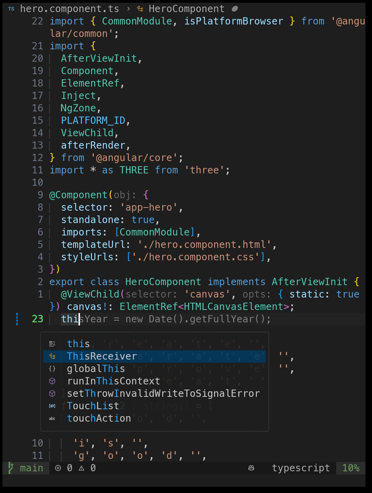

# My Shell and Neovim Config 




## Description 
This script automates the setup of essential tools, configurations, and dotfiles for Linux and Termux environments.

It installs the following tools and configurations:
1. Ohm-My-Zsh (With Powerlevel10k Theme)
2. Neovim (For Web Development)
3. Git Configuration (With SSH)


## Installation

To get started, follow these steps:

1. Run the following command in your terminal.

```bash
bash -c "$(curl -fsSL https://raw.githubusercontent.com/HaroonSaifi17/MyDotFiles/master/setup.sh)"
```

2. Restart your terminal.

## Manual Installation

1. Clone this repository to your local machine.

```bash
git clone https://github.com/haroonsaifi17/MyDotFiles && cd MyDotFiles
```

2. setup

```bash
chmod +x ./setup.sh && ./setup.sh
```
## License 
This project is licensed under the MIT License - see the [LICENSE](LICENSE) file for details.

## Contribution 
Contributions are welcome! Feel free to submit a pull request or open an issue.
